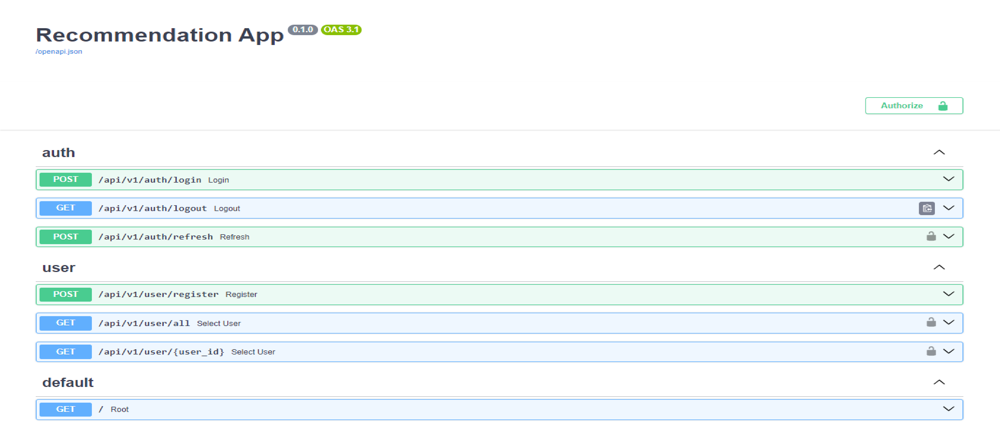

# CustomAuthFastAPI


---

## About 
Simple implementation of **OAuth 2.0** authorization 
for monolithic web applications implemented using the **Fast API** framework. 

The application creates two jwt tokens - **access_token** and **refresh_token** at login. 
The access token is sent to the user in the response body and subsequently accepted 
in the header. The refresh token is placed in cookies and retrieved by the application 
itself, without additional interactions with it.
The access token is given in the header when updating, 
the refresh token is placed in cookies when updating.


The application also implements access rights verification for two roles:
* **user**
* **admin**

**P.s. Python version 3.11 is required for the web application to work correctly**

### The repository contains the following components:
* **[About](#About)**
* **[Rest API Structure](#Rest API Structure)**
    * [Auth](#Auth)
    * [User](#User)
    * [Start-RestAPI](#Start-RestAPI)
* **[Database](#Database)**


---
## Rest API Structure

The web application consists of two modules:
* Auth - responsible for the authorization and updating of tokens
* User - responsible for working with the user entity



---
### Auth 

Consists the following handlers:
* POST /api/v1/auth/login - login in the application
* GET /api/v1/auth/logout - logout in the application
* POST /api/v1/auth/refresh - refresh_tokens

---
### User

Consists the following handlers:
* POST /api/v1/user/register - register user
* GET /api/v1/user/all - select list info of users
* GET /api/v1/user/{user_id} - select info about user by user_id

---
### Start RestAPI

1. Go to the directory `src`
```shell
cd src
```
2. Create `.env` file with
```shell 
touch .env
```
3. Add variable in the `.env` file
```
DB_HOST=
DB_PORT=
DB_NAME=
DB_USER=
DB_PASS=

ACCESS_TOKEN_EXPIRE_MINUTES=
REFRESH_TOKEN_EXPIRE_DAYS=

PRIVATE_KEY=./private.pem
PUBLIC_KEY=./public.pem
```
4. Create keys `private.pem` and `public.pem`
```shell
python ../create_keys.py
```
5. Install packages
```shell
pip install -r requirements.txt
```
6. Run Rest API
```shell
uvicorn app:app --reload
```
---

## Database

For the Rest API to work correctly, you need to create a database with the data 
described in the file `./src/models/models.py`. You can do this yourself or 
perform migrations by following the instructions below.

**P.s. The instructions imply that the required database has already been created**

1. Go to the directory `database`
```shell
cd database
```
2. Create `.env` file with
```shell 
touch .env
```
3. Add variable in the `.env` file
```
DB_HOST=
DB_PORT=
DB_NAME=
DB_USER=
DB_PASS=

LOGIN=
PASSWORD=
EMAIL=
ROLE=
```
4. Run command
```shell
alembic upgrade head
```